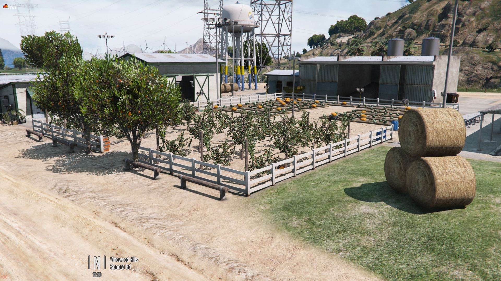
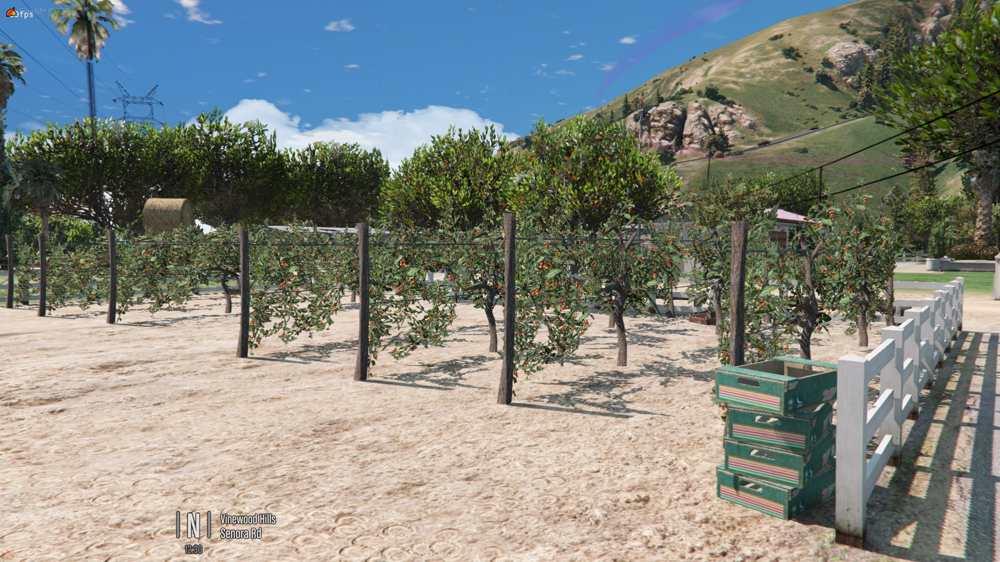
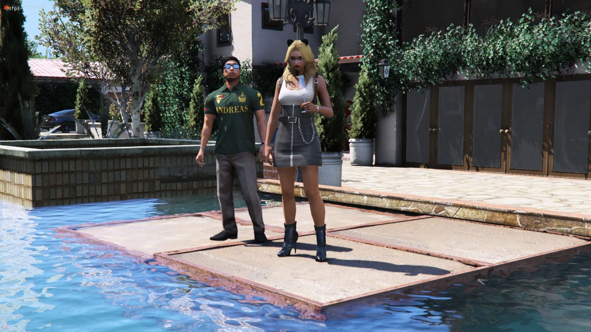

# Ranch De Caniche

Madrazo's Ranch With Cinema, originally created by AleBrambi45 and modified by TayMcKenzieNZ with permission.

'Ranch De Caniche' translates to French, meaning 'Poodle Ranch'.

 This resource is for FiveM usage with the understanding that you will not edit or reupload elsewhere. 
 It is to work alongside [[pmms](https://github.com/kibook/pmms)] for playing content on the cinema screen, as well as [[fivem-scenarios](https://github.com/kibook/fivem-scenarios)] for interacting with scenarios around the world, including the cinema seats.

# Screenshots

| | | |
|-|-|-|
|  |  |  |
|  |  |  |
|  |  |  |
|  |  |  |
|  |  |  |
|  |  |  |
|  |  |  |
|  |  |  |
|  | |  | 
| | |  |
|  |  |  |
|  |  |  |
|  |  |  |
|  |  |  |
|  |  |  |
|  |  |  |
|  |  |  |
|  |  |  |
|  | |  |

# Installing

1. Add to your resources folder.

2. Add `start RanchDeCaniche` to your server.cfg

3. For Christmas props, add the files provided in the `OPTIONAL XMAS` folder. Backups are provided.

4. Install [pmms](https://github.com/kibook/pmms) and be sure to read the [ReadMe](https://github.com/kibook/pmms/blob/master/README.md) thoroughly.

5. Type /pmms in chat while near the basement cinema and/or TV screens, select the screen and open advanced settings. Enter the following and save as an entity, not model:

   | Name                | Volume | Same Room Attenuation | Diff Room Attenuation      | Diff Room Volume      | Range |
   |---------------------|--------|-----------------------|----------------------------|-----------------------|-------|
   | Ranch Cinema        | 100    | 0                     | 4.2                        | 0.25                  | 10    |
   | Ranch TV Basement 1 | 100    | 0.5                   | 7                          | 0.02                  | 10    |
   | Ranch Basement TV 2 | 100    | 0.5                   | 7                          | 0.02                  | 10    |

**PMMS by Kibook is NOT included in this repository.**

# Enjoy 🥰
